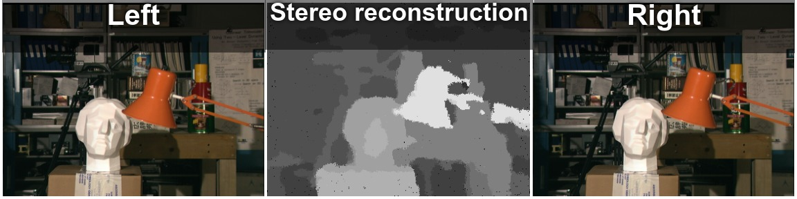

# Probabilistic graphical models - stereo reconstruction
3D reconstruction from two 2D images.

Loopy belief propagation (LBP) and Markov random field (MRF) algorithms are used.

Based on http://nghiaho.com/?page_id=1366

